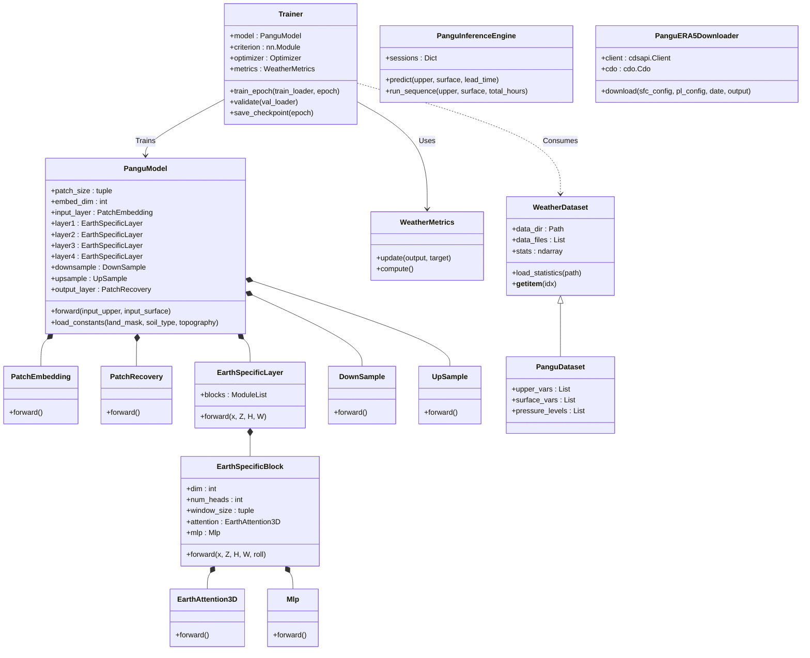

# Pangu-Weather Class Architecture

```mermaid
classDiagram
    %% Model Architecture
    class PanguModel {
        +patch_size : tuple
        +embed_dim : int
        +input_layer : PatchEmbedding
        +layer1 : EarthSpecificLayer
        +layer2 : EarthSpecificLayer
        +layer3 : EarthSpecificLayer
        +layer4 : EarthSpecificLayer
        +downsample : DownSample
        +upsample : UpSample
        +output_layer : PatchRecovery
        +forward(input_upper, input_surface)
        +load_constants(land_mask, soil_type, topography)
    }

    class PatchEmbedding {
        +forward()
    }
    
    class PatchRecovery {
        +forward()
    }

    class EarthSpecificLayer {
        +blocks : ModuleList
        +forward(x, Z, H, W)
    }

    class EarthSpecificBlock {
        +dim : int
        +num_heads : int
        +window_size : tuple
        +attention : EarthAttention3D
        +mlp : Mlp
        +forward(x, Z, H, W, roll)
    }

    class EarthAttention3D {
        +forward()
    }
    
    class Mlp {
        +forward()
    }

    class DownSample {
        +forward()
    }

    class UpSample {
        +forward()
    }

    PanguModel *-- PatchEmbedding
    PanguModel *-- EarthSpecificLayer
    PanguModel *-- DownSample
    PanguModel *-- UpSample
    PanguModel *-- PatchRecovery

    EarthSpecificLayer *-- EarthSpecificBlock
    EarthSpecificBlock *-- EarthAttention3D
    EarthSpecificBlock *-- Mlp

    %% Training Module
    class Trainer {
        +model : PanguModel
        +criterion : nn.Module
        +optimizer : Optimizer
        +metrics : WeatherMetrics
        +train_epoch(train_loader, epoch)
        +validate(val_loader)
        +save_checkpoint(epoch)
    }

    Trainer --> PanguModel : Trains
    Trainer --> WeatherMetrics : Uses

    class WeatherMetrics {
        +update(output, target)
        +compute()
    }

    %% Data Module (Training)
    class WeatherDataset {
        +data_dir : Path
        +data_files : List
        +stats : ndarray
        +load_statistics(path)
        +__getitem__(idx)
    }

    class PanguDataset {
        +upper_vars : List
        +surface_vars : List
        +pressure_levels : List
    }

    WeatherDataset <|-- PanguDataset
    Trainer ..> WeatherDataset : Consumes

    %% Inference Module
    class PanguInferenceEngine {
        +sessions : Dict
        +predict(upper, surface, lead_time)
        +run_sequence(upper, surface, total_hours)
    }

    %% Data Integration (Scripts)
    class PanguERA5Downloader {
        +client : cdsapi.Client
        +cdo : cdo.Cdo
        +download(sfc_config, pl_config, date, output)
    }
```
